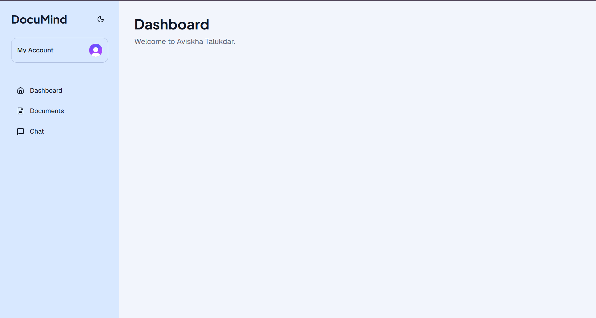
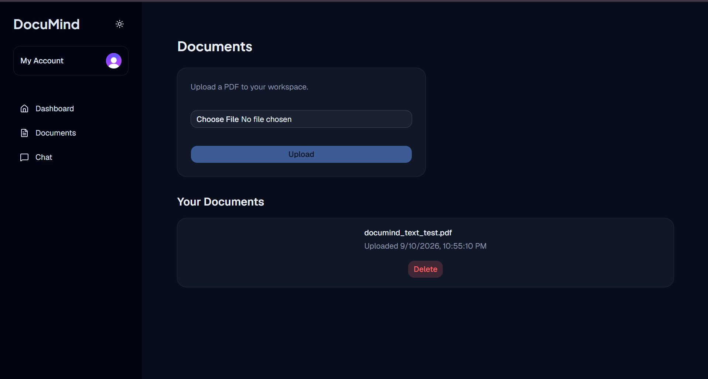
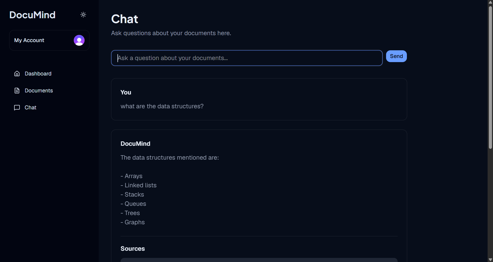

# 🧠 DocuMind

**An AI-powered document knowledge base — upload PDFs, ask questions, get grounded answers.**

DocuMind is a full-stack Retrieval-Augmented Generation (RAG) application built to run at **$0 cost**, in both development and production. It uses a dual-provider architecture — local models for development, free hosted APIs for production — with no paid AI service required anywhere in the stack.

[](https://nextjs.org/)
[](https://www.typescriptlang.org/)
[](https://neon.tech/)
[](https://www.prisma.io/)
[](https://clerk.com/)
[](https://www.docker.com/)
[](https://vercel.com/)
[](./LICENSE)

**[Live Demo →](https://getdocumind.vercel.app)**

---

## 📸 Screenshots

### Dashboard



### Documents



### RAG Chat


---

## ✨ Features

- 🔐 **Authentication** — email/password sign-up and sign-in via Clerk, with automatic user & workspace provisioning on first login
- 🛡️ **Route protection** — unauthenticated users are redirected to `/sign-in`; authenticated state is reflected via Clerk's `UserButton` in the UI
- 📄 **PDF upload & processing** — upload, text extraction, and persistent storage
- 🧩 **Smart chunking** — documents are split into overlapping chunks for better retrieval accuracy
- 🧠 **Dual-provider embeddings** — local Transformers.js model in development, Hugging Face's hosted Inference API in production (same model, same 384-dimensional vector space, no schema differences between environments)
- 🔎 **Semantic search** — pgvector-powered cosine similarity search retrieves the most relevant chunks for any question
- 🤖 **Grounded AI answers** — responses are generated strictly from retrieved document context, with an explicit instruction to decline rather than fabricate when context is insufficient
- ⚡ **Dual-provider LLM** — Ollama (`llama3.2:3b`) locally for free, fast iteration; Groq (`openai/gpt-oss-20b`) in production for free, fast hosted inference with no dependency on a local machine
- 💬 **Streaming chat** — token-by-token streamed responses with cited source chunks
- 🌗 **Light/dark mode** — custom pastel color system with a theme toggle, built on CSS custom properties
- 🐳 **Dockerized** — fully containerized for consistent local and production-parity testing
- ☁️ **Deployed on Vercel** — live, publicly accessible production deployment
- 💰 **$0 architecture, dev and prod** — every service used (Neon, Supabase, Clerk, Groq, Hugging Face, Vercel) has a genuinely free tier; no credit card required anywhere in the stack

---

## 🏗️ Architecture

```
                        ┌──────────────┐
                        │    Clerk     │
                        │     Auth     │
                        └──────┬───────┘
                               │
                               ▼
   ┌───────────┐        ┌──────────────┐
   │   User    │───────▶│   Next.js    │
   │ (Browser) │        │  App Router  │
   └───────────┘        └──────┬───────┘
                               │
              ┌────────────────┼────────────────────┐
              ▼                ▼                     ▼
        ┌───────────┐   ┌────────────┐    ┌────────────────────┐
        │ Supabase  │   │  Neon +    │    │  Embeddings + LLM   │
        │ Storage   │   │  Prisma +  │    │  (env-dependent,    │
        │ (PDFs)    │   │  pgvector  │    │  see table below)   │
        └───────────┘   └────────────┘    └────────────────────┘
```

**Environment-dependent providers:**

| Service | Development | Production |
|---|---|---|
| Embeddings | Local Transformers.js (`Xenova/all-MiniLM-L6-v2`) | Hugging Face Inference API (`sentence-transformers/all-MiniLM-L6-v2`) — same model, same output shape |
| LLM | Ollama (`llama3.2:3b`), runs on localhost | Groq (`openai/gpt-oss-20b`), hosted |

This split exists because Vercel's serverless functions can't load the native binaries (ONNX runtime, canvas) that local, in-process ML inference depends on. Rather than fight that constraint, DocuMind calls out to hosted equivalents in production and keeps the fast, zero-latency local path for development.

**Data flow — document ingestion:**
```
PDF Upload → Text Extraction (unpdf) → Chunking → Embedding
  (local model in dev / Hugging Face API in prod) → Stored as vectors in pgvector
```

**Data flow — question answering:**
```
User Question → Query Embedding → pgvector Similarity Search →
  Top-K Relevant Chunks → LLM (Ollama in dev / Groq in prod) →
  Streamed Answer + Cited Sources
```

---

## 🛠️ Tech Stack

| Layer | Technology | Purpose |
|---|---|---|
| Framework | Next.js 16 (App Router) | Full-stack React framework |
| Language | TypeScript | Type safety across the stack |
| Styling | Tailwind CSS + shadcn/ui | Component system & theming |
| Database | Neon (PostgreSQL) | Primary data store |
| ORM | Prisma 7 | Type-safe database access |
| Vector Search | pgvector | Semantic similarity search |
| Auth | Clerk | Authentication, session management, route protection |
| File Storage | Supabase Storage | PDF file storage |
| PDF Parsing | unpdf | Serverless-compatible text extraction (no native canvas dependency) |
| Embeddings (dev) | Transformers.js (`Xenova/all-MiniLM-L6-v2`) | Local, free, on-device embeddings |
| Embeddings (prod) | Hugging Face Inference API | Free hosted embeddings, serverless-compatible |
| LLM (dev) | Ollama (`llama3.2:3b`) | Local, free inference for development |
| LLM (prod) | Groq (`openai/gpt-oss-20b`) | Free-tier hosted inference for production |
| Containerization | Docker | Local production-parity testing |
| Deployment | Vercel | Hosting for the Next.js app |

---

## 🚀 Getting Started

### Prerequisites

- Node.js 22+
- A free [Neon](https://neon.tech) PostgreSQL database (with the `vector` extension enabled)
- A free [Clerk](https://clerk.com) application
- A free [Supabase](https://supabase.com) project (Storage bucket)
- A free [Groq](https://console.groq.com) API key (production LLM)
- A free [Hugging Face](https://huggingface.co) API token (production embeddings)
- [Ollama](https://ollama.com) installed locally (development LLM) — optional but recommended

### Installation

```bash
git clone https://github.com/aviskha23/documind.git
cd documind
npm install
cp .env.example .env
# Fill in your keys — see Environment Variables below
```

### Environment Variables

Create a `.env` file with the following keys (no quotes around values):

```env
# Database
DATABASE_URL=
DATABASE_URL_POOLED=

# Clerk (test keys for local dev; live keys are set separately in Vercel for prod)
NEXT_PUBLIC_CLERK_PUBLISHABLE_KEY=
CLERK_SECRET_KEY=

# Supabase
NEXT_PUBLIC_SUPABASE_URL=
NEXT_PUBLIC_SUPABASE_PUBLISHABLE_KEY=
SUPABASE_SERVICE_ROLE_KEY=

# LLM providers
OLLAMA_URL=http://localhost:11434
GROQ_API_KEY=

# Embeddings (production)
HUGGINGFACE_API_KEY=
```

> Note: production and development use **separate** Clerk key pairs (test vs. live). Local `.env` should always use test keys; live keys are configured directly in Vercel's environment variable settings, never committed.

### Database setup

```bash
npx prisma migrate dev
```

### Run locally

```bash
npm run dev
```

Open [http://localhost:3000](http://localhost:3000). This uses Ollama and local embeddings.

### Run with Docker

```bash
docker build \
  --build-arg NEXT_PUBLIC_CLERK_PUBLISHABLE_KEY=your_key \
  --build-arg NEXT_PUBLIC_SUPABASE_URL=your_url \
  -t documind .

docker run -p 3000:3000 --env-file .env documind
```

Docker networking note: the containerized app reaches host-machine Ollama via `http://host.docker.internal:11434`, not `localhost`.

### Production deployment

Deployed on Vercel, connected to the `main` branch. Vercel's build command is overridden to `prisma generate && next build` to ensure the Prisma client is generated correctly in Vercel's build environment. Production environment variables use live Clerk keys, Groq, and the Hugging Face Inference API instead of their local-only counterparts.

---

## 🗺️ Roadmap

**Done:**
- [x] Authentication & workspace management, with route protection
- [x] PDF upload, storage, and text extraction
- [x] Local + hosted embeddings with pgvector semantic search
- [x] Streaming RAG chat with cited sources
- [x] Docker containerization
- [x] Production deployment on Vercel with dual-provider architecture

**Not yet implemented:**
- [ ] Google OAuth sign-in
- [ ] OCR support for scanned/image-only PDFs
- [ ] Multi-document conversation context
- [ ] Persistent chat history across sessions
- [ ] Team/multi-user workspaces

---

## 🧠 Design Decisions

- **Local-first, hosted-fallback architecture**: rather than run every service identically in dev and prod, DocuMind uses whichever provider fits each environment's constraints — local models where possible (fast, free, no network dependency), hosted free-tier APIs where serverless limitations make local inference impractical.
- **Swapped `pdf-parse` for `unpdf` in production**: `pdf-parse`'s canvas dependency relies on native bindings (`DOMMatrix`, `@napi-rs/canvas`) that don't run in Vercel's serverless functions. `unpdf` is pure JavaScript and serverless-compatible by design.
- **Hugging Face Inference API over local ONNX in production**: Vercel's serverless runtime can't load the native ONNX runtime binary (`libonnxruntime.so`) that local Transformers.js embeddings depend on. Calling the same model via Hugging Face's hosted API avoids the native dependency entirely while producing identical vectors, so no schema or migration changes were needed.
- **pgvector over a dedicated vector database**: extending the existing Postgres instance with the `pgvector` extension avoided introducing a separate vector store (e.g. Pinecone) for one additional capability.
- **Server-Sent Events for streaming**: chosen over WebSockets since chat is a one-directional request → streamed-response pattern that doesn't need a persistent bidirectional connection.

---

## 📄 License

MIT

---

## 🙋 About

Built as a full-stack learning project to explore RAG architecture, dual local/hosted AI inference strategies, and the practical differences between local and serverless deployment environments — from database design through Docker and live production deployment.